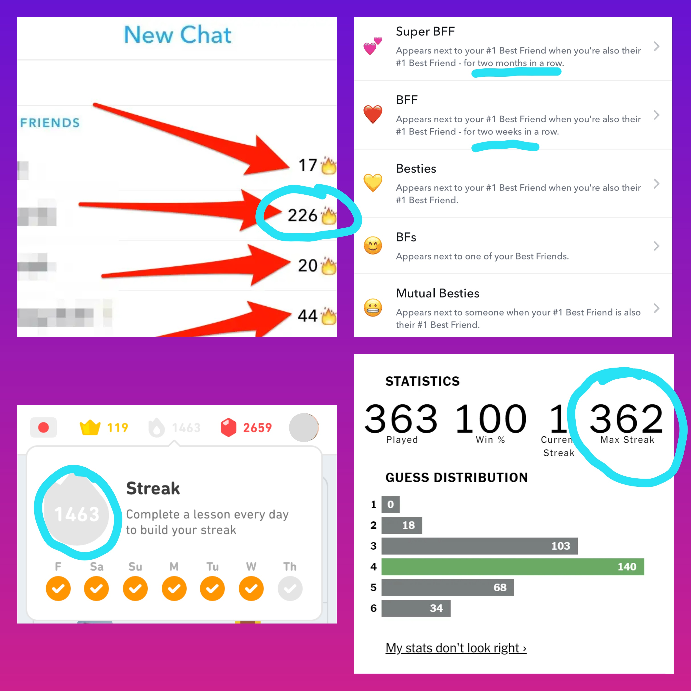
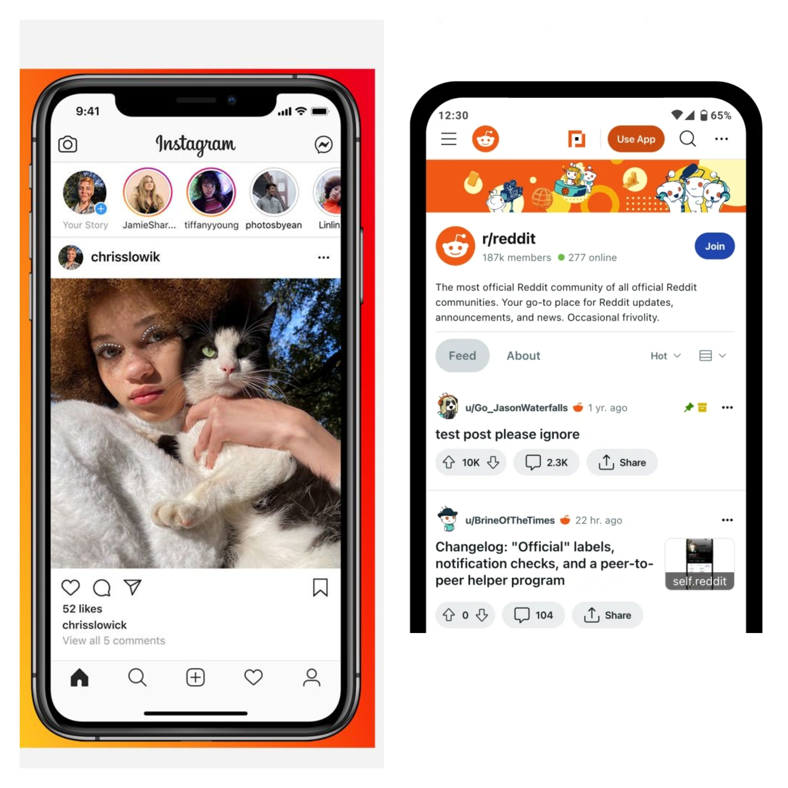
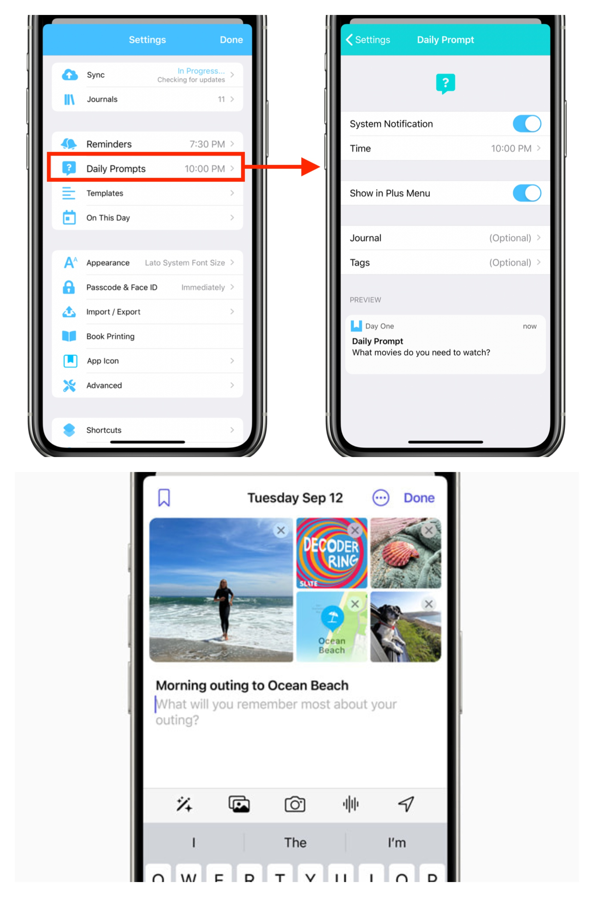

# Assignment 2

<!-- TalkChat
    Rather than just sending black screens to people on the daily, this app encourages you to actually talk to your friends. You can maintain a streak for how many days you've talked to a friend in a row, and the app gives you fun questions or prompts for you both to respond to, creating an even tighter bond in your friendship. -->

## Broad Application Goals

### TalkChat

**Audience:** people looking to get to know their friends better (teenagers+?)

**Value:** This app will prompt users daily to answer a question about themselves, and they will be able to see their friends' answers to learn new information about them.

## Scrapbook of Comparables

<figure>
  
  <figcaption>Snapchat, Duolingo, and Wordle all have streaks for different reasons. Could be applied to my app to "measure friendship" too</figcaption>
</figure>

<figure>
  
  <figcaption>On GuessMe.io, people vote for a question, and then guess which vote holds the majority. Perhaps guessing your friends' answers to questions could be part of my app, to gamify it a lil</figcaption>
</figure>

<figure>
  
  <figcaption>Instagram and Reddit have scroll-ing feeds of other user's posts; could also have a feed to view friend's answers to questions</figcaption>
</figure>

<figure>
  
  <figcaption>Day One has optional daily notifications, something similiar could be used in my app. Apple Journal has a clean entry-entering place that lets you see the pictures as you type; users in my app should probably be able to see the question/prompt as they type as well, with minimal distractions</figcaption>
</figure>

### Brainstorming Feature Ideas
1. Streak-ing: Earn rewards for connecting with a friend daily
2. Guessing: Guess your friend's answer to a question for extra "points" 
3. Global Viewing: See how other users responded to a question, and why
4. Commenting: Comment on other users' responses to a prompt
5. Posting: Post a question/poll to be answered by others
6. Upvoting: Upvote a question/poll that looks interesting

### VSD Analysis

#### Pervasiveness
- **Observation:** This design might be well-suited to be broadly adapted into an ask-and-answer widget of sorts, perhaps centered around a community of some kind.
- **Design Response:** To be adapted broadly, this app might help members of a specific community connect with others of that community. In this sense, there may be an invite-only forum where and questions posted are only for members of that community.

#### Values
- **Observation:** The prompts that the users respond to might end up being inappropriate or controversial, and both prompts and answers might end up causing harm to users and their communities.
- **Design Response:** Much like other social media apps, this one will have to be moderated too. All answers will be moderated to prevent hate speech, and all suggested prompts would be checked. Some prompts may be marked NSFW and only accessed by verified users over 18.

#### Time
- **Observation:** This app would definitely work differently among a small group of people vs a large group. A small group of people all from a single community could learn more about each other, in ways that could lead to real-life connections, but prevents a global view of any questions/polls. On the other hand, large amounts of people might end up failing to form any personal connections, and only ever receive a global outlook on their questions/polls.
- **Design Response:** As said for Pervasiveness, a seperate, private forum for community members would be a good way for users in large amounts to ask/answer questions relevant to them. For small groups, a lack of global view hopefully shouldn't take too much away from the app, as personal connections are more favored anyways.

#### Stakeholders
- **Observation:** People directly affected by the app would be anyone willing to learn more about their friends. Indirectly, anyone viewing controversial answers/questions may have an effect, especially if someone goes viral for their answers/questions
- **Design Response:** Any viral popularity should be handled by the app (as dealt with in Time), and users who go viral on the app aren't neccessarily bad. Their content should be monitored like all other users anyways. 

### Storyboarding

  

  
